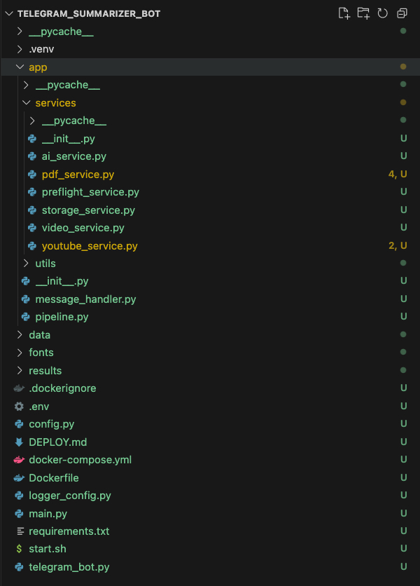
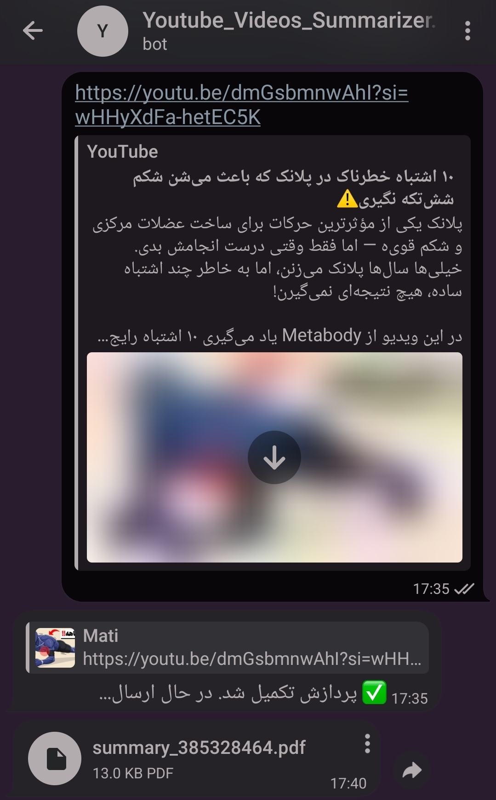
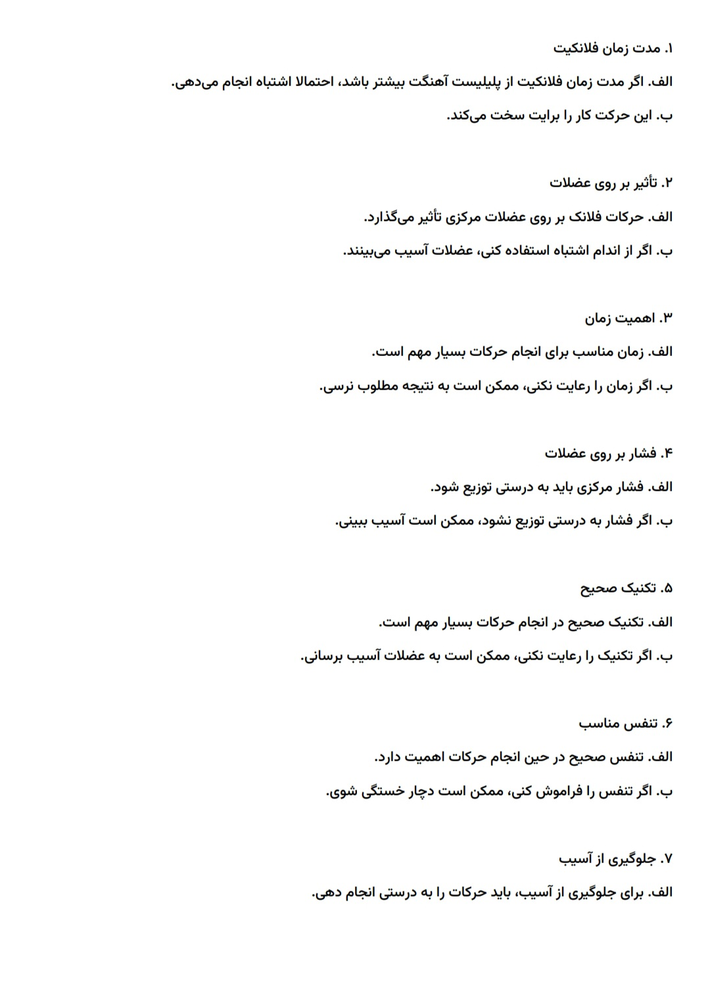
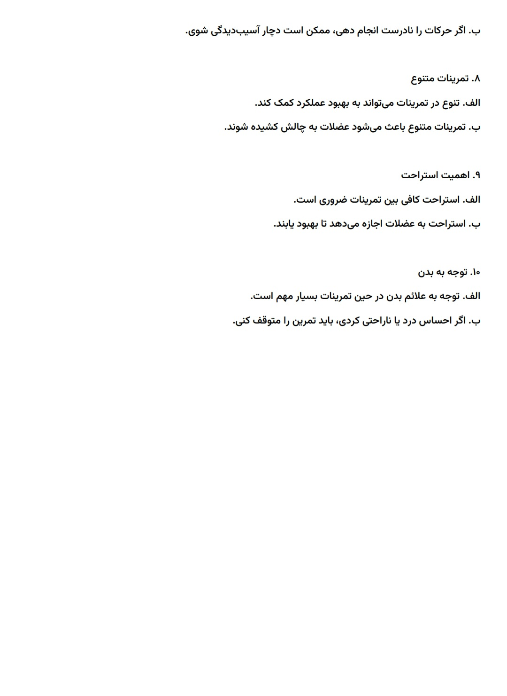

# YouTube Telegram Summarizer Bot

AI Pipeline | FastAPI | Docker | Whisper | OpenRouter | Telegram Bot

An AI-powered Telegram bot that converts YouTube videos into structured Persian study notes and downloadable PDF summaries using speech recognition and LLM-based summarization.

---

## Project Description

This project automates the process of extracting educational content from YouTube videos and transforming it into clean Persian summaries.

The system:
- Downloads YouTube videos
- Extracts audio
- Converts speech to text using Whisper
- Summarizes and restructures content using LLMs
- Generates Persian PDF notes
- Delivers results through a Telegram bot interface

The architecture was designed using modular AI pipeline components, FastAPI services, Docker containers, and asynchronous Telegram bot communication.

---

## Features

- 🎥 YouTube video processing
- 🔊 Audio extraction pipeline
- 🧠 Whisper speech-to-text transcription
- ✍️ AI-powered Persian summarization
- 📄 Automatic PDF generation
- 🤖 Telegram bot integration
- 🐳 Dockerized backend services
- ⚡ FastAPI asynchronous backend
- 🛠 Error handling for API/network failures
- 📦 Modular pipeline architecture

---

## My Contributions

### Backend & System Integration
- Developed backend integration using FastAPI
- Integrated AI pipeline modules with Telegram bot workflows
- Managed synchronization between pipeline stages
- Implemented file handling and PDF processing workflows
- Configured Docker environment and containerized services
- Worked on system reliability and timeout/error handling

### Collaboration
Worked as part of a team-based AI engineering project:
- AI Pipeline & NLP Processing — https://github.com/Eyna-A
- Database & Telegram Bot Logic — https://github.com/Anita387
- Backend Integration, File Handling, Docker & FastAPI — my contribution

---

## Project Architecture



---

## Technologies Used

- Python
- FastAPI
- Docker
- OpenAI Whisper
- OpenRouter API
- Telegram Bot API
- OpenCV
- MoviePy
- ReportLab
- yt-dlp

---
## AI Pipeline Flow

```text
YouTube Link
      ↓
Video Download
      ↓
Audio Extraction
      ↓
Speech-to-Text (Whisper)
      ↓
LLM Summarization
      ↓
PDF Generation
      ↓
Telegram Delivery
```

---

## Telegram Bot Interface



---

## Generated PDF Examples



[Open Full PDF](outputs/sample_output.pdf)

---

## Docker Setup

```bash
docker build -t telegram-summarizer .
docker run -p 8000:8000 telegram-summarizer
```

---

## Environment Variables

Create a `.env` file:

```env
OPENROUTER_API_KEY=your_openrouter_key
TELEGRAM_BOT_TOKEN=your_telegram_bot_token
```

---

## Running the Project

```bash
pip install -r requirements.txt
python main.py
```

---

## Current Project Status

The AI pipeline, transcription workflow, PDF generation, and backend integration were successfully implemented and tested locally.

Deployment and live Telegram integration testing were partially affected by regional network and API connectivity limitations.

